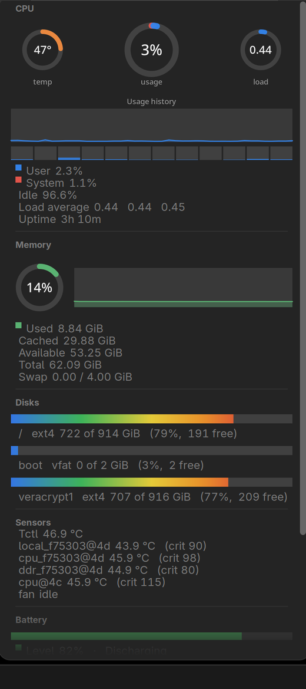
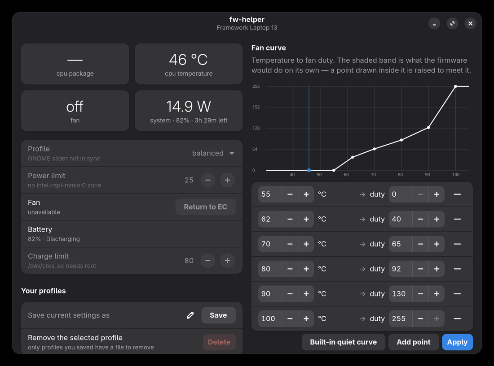

# fw-helper — AMD Framework 13 fork

Firmware control and system monitoring for the **Framework Laptop 13 (AMD Ryzen AI 300)**
on Linux.

This is a hardware fork of [Wooloomooloo2/fw-helper](https://github.com/Wooloomooloo2/fw-helper),
which targets the **Intel** Framework 13 Pro. That project's architecture, ADRs and safety
model are carried over wholesale; what changed is everything that touches this board, which
turned out to be most of the hardware layer. Use upstream if you have an Intel board — it is
further along, and none of the caveats below apply to it.

> **Status: hardware characterised, port in progress.** The monitoring works today. Fan
> control is *proven possible* on this board but not yet wired into the daemon. Power limits
> have no mechanism here at all. Read the table before expecting anything.


CPU and memory sparklines, a usage bar per mounted drive, the battery with its percentage
inside it, then temperature, fan and power draw. Every screenshot here is from the machine
described under [Hardware](#hardware) — nothing is mocked up.

## Why a fork rather than a patch

Four of the interfaces upstream depends on are absent or different here, and two of its
ADRs do not hold. This is not a matter of a few `#[cfg]` branches:

| | Intel Pro (upstream) | This board |
|---|---|---|
| Board / EC | `FRANMJCP07`, `sakura-3.0.2` | `FRANMGCP05`, **`lilac-3.0.5`** |
| Fan control | `pwm1` + `pwm1_enable` in sysfs | **neither exists** — raw EC commands only |
| Fan duty | 0–255, with read-back | **percent 0–100, no read-back at all** |
| Power limits | `intel-rapl-mmio:0`, PL1 writable | **no RAPL** (`enabled=0`, no MMIO zone) |
| Profiles | power-profiles-daemon | **not installed**; `amd-pmf` owns `platform_profile` |
| Sensors | 5, incl. `peci-temp`, `battery_temp` | 4 — **neither of those two** |

Everything above was measured, not assumed. The full survey is in
[docs/hardware-baseline-amd.md](docs/hardware-baseline-amd.md); upstream's Intel figures are
in `docs/hardware-baseline.md` and **do not carry over**.

## What works, honestly

| Feature | Status |
|---|---|
| **Cinnamon panel applet** | **Working** — temps, fan, load, memory, disks, battery, top processes. Needs no daemon and no root |
| Live telemetry | **Working** — temps, fan RPM, battery draw and charge rate |
| Capability detection | **Working** — every knob reports available, or why not |
| Performance profiles | **Working** — writes `platform_profile` directly, since there is no PPD here to defer to |
| GUI | **Working**, with the fan and power controls inert until the port lands |
| Battery charge limit | **Mechanism confirmed, efficacy unproven.** Framework's EC command `0x3E03` answers on this firmware ([ADR 0012](docs/adr/0012-charge-limit-via-custom-ec-command.md)), but nothing has yet watched a charge actually *stop* at the limit. Upstream's hardest-won lesson is that read-back is not efficacy |
| Fan control | **Possible, not yet implemented.** Duty writes move the fan and the EC reclaims it cleanly — measured. The daemon still targets the sysfs attributes this board lacks, so the capability reports unavailable ([ADR 0013](docs/adr/0013-fan-control-via-ec-commands.md)) |
| Power limits | **No mechanism exists.** No RAPL, and Framework's EC command set has no PPT or SOC power command. On AMD the limits move through `amd-pmf`'s profiles, so that is where power control lives |
| Undervolting | Not attempted |

## The Cinnamon applet

The most finished part of this fork, and independent of everything else — it reads `/proc`
and sysfs directly, so it needs no daemon, no D-Bus policy and no root.

```bash
./scripts/install-applet.sh          # per-user; --link instead, for development
```

Then right-click the panel → Applets → **Framework Monitor**.



**Panel:** CPU and memory sparklines, a usage bar per mounted drive, a battery with its
percentage inside it, and CPU temperature, fan speed and power draw as text.

**Dropdown:** ring gauges for temperature, CPU usage and load; a usage-history chart;
per-core bars; a user/system/idle breakdown; every EC sensor with its critical threshold;
memory and swap; every mounted filesystem; battery charge in mAh, health against design
capacity, and cycle count; and the top processes by CPU. It scrolls, because on a laptop
screen it is taller than the display.

The dropdown's layout follows [Stats](https://github.com/exelban/stats) on macOS: gauges
first, then history, then the breakdown, then what is responsible.

<br clear="right">

The screenshot above is a live one, which is why the disk list has three real entries —
`/`, `/boot`, and an unlocked VeraCrypt volume that the applet picked up on its own.

Details worth knowing:

- **Drives are detected from `/proc/mounts`**, so a VeraCrypt or USB volume appears when
  mounted and vanishes when closed, with nothing to configure. FUSE bookkeeping mounts are
  filtered out — including VeraCrypt's own auxiliary mount, which is not your data.
- **Power draw is only reported on battery.** On mains, `current_now` is what goes *into*
  the battery, so it is shown separately as a charge rate (`+32W`) and never as system draw.
- **The panel holds a constant width.** Readings are drawn into a canvas sized from the
  widest value each field can ever take, so a number that gains a digit — or a `+` that
  appears when you plug in — never shifts the applets beside it.
- **HiDPI is handled**, and the process list is only gathered while the dropdown is open,
  since walking every `/proc/PID` on the compositor's own main loop is the one thing here
  that could stutter the desktop.

## The application



Carried over from upstream, and worth reading as a status report in itself: the controls
that cannot work on this board say so rather than sitting there dead. `cpu package` shows a
dash because there is no RAPL energy counter, the power limit explains that there is no
`intel-rapl-mmio:0` zone, and the fan reports unavailable until [ADR 0013](docs/adr/0013-fan-control-via-ec-commands.md)
is implemented. Whole-machine draw, temperature, battery and profiles all work.

The fan curve editor is shown for completeness — it edits and saves a curve, but nothing
drives the fan from it yet on this hardware.

## Hardware

Developed and measured against:

- Framework Laptop 13 (AMD Ryzen AI 300), board `FRANMGCP05`, BIOS 03.05
- AMD Ryzen AI 5 340, EC firmware `lilac-3.0.5`
- Arch Linux, kernel 7.1.11

Other AMD Framework 13 boards will probably behave similarly, but nothing here has been run
on one. The daemon probes capabilities at startup and disables what it cannot drive, so a
mismatch should be inert rather than dangerous — that is the design, not a measurement.

## Safety

Manual fan control is genuinely risky: once userspace takes over, the EC stops managing the
fan and holds the last duty written, so a crashed daemon can leave it stuck low under load.
[ADR 0006](docs/adr/0006-fail-safe-fan-control.md) specifies the mitigations.

**This board weakens three of them, and [ADR 0013](docs/adr/0013-fan-control-via-ec-commands.md)
records exactly how** rather than leaving the safety story reading as intact:

- **Duty writes cannot be verified.** There is no duty register to read back. Replaced by
  unconditional periodic re-assertion.
- **There is no fan mode register.** The daemon cannot ask whether it holds the fan, and RPM
  cannot answer — a manual duty of 0 and EC-auto-at-idle both read 0 rpm. So it releases
  unconditionally rather than conditionally, which is weaker as diagnosis and no weaker as
  repair.
- **Firmware's own duty cannot be observed**, so the floor learns from RPM and inverts one
  measured table rather than reading duty directly.

Measured on this board and worth carrying into any curve: the fan **stalls** below 10% duty
but will not **start** from rest below 11%, and a curve idling in that gap runs correctly
down a whole cooldown then silently fails to spin up from cold. Also note `ddr_f75303@4d`
reports its limit at **79.85 °C**, seven degrees below the Intel board's.

`kill -9` recovery is a release gate upstream. **It has not been exercised on this board**,
because the fan port is not done.

## Build and run

```bash
cargo build --release --all
cargo test --all                     # no hardware, no root, no network
```

The GUI and daemon can run on the session bus without root, which is enough for telemetry:

```bash
FW_HELPERD_SESSION_BUS=1 ./target/release/fw-helperd &
FW_HELPERD_SESSION_BUS=1 ./target/release/fw-helper
```

For the charge limit you need the root daemon and its D-Bus policy:

```bash
sudo ./scripts/install-dev.sh --systemd
fw-helperctl status
```

There is no Arch package yet — upstream's `build-deb.sh` targets Debian.

## Poking at your own machine

All read-only unless stated:

```bash
./scripts/fw-probe.sh                     # general survey
sudo ./scripts/probe-power-amd.sh         # is there any usable power telemetry?

gcc -O2 -Wall -o probe-ec-amd  scripts/probe-ec-amd.c
gcc -O2 -Wall -o probe-fan-amd scripts/probe-fan-amd.c

sudo ./probe-ec-amd                       # EC feature flags and the charge limit
sudo ./probe-fan-amd                      # WRITES: spins the fan up, then releases it
sudo ./probe-fan-amd --sweep              # WRITES: duty -> RPM table
sudo ./probe-fan-amd --breakaway          # WRITES: lowest duty that starts the fan
```

The fan probes only ever spin the fan *up*, install their restore handler before the first
write, and release the fan on every exit path including SIGINT. Read them before running
them.

## Prior art

- [Wooloomooloo2/fw-helper](https://github.com/Wooloomooloo2/fw-helper) — upstream, for Intel boards
- [framework-system](https://github.com/FrameworkComputer/framework-system) — Framework's own tooling; the reference for EC host commands
- [fw-fanctrl](https://github.com/TamtamHero/fw-fanctrl) — established fan curve daemon
- [G-Helper](https://github.com/seerge/g-helper) — the original inspiration, for ASUS on Windows
- [Stats](https://github.com/exelban/stats) — the macOS monitor the applet's dropdown is modelled on

## Licence

GPL-3.0, as upstream. See [ADR 0001](docs/adr/0001-separate-repository.md#licensing-note).
